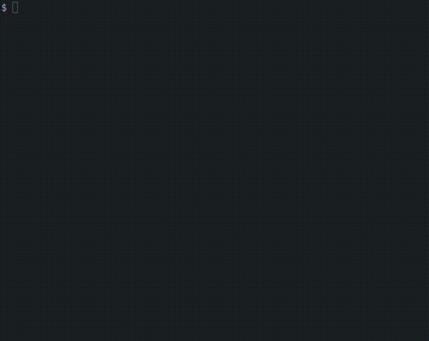

<h1 align="center">subfinder</h1>

<p align="center">
  <a href="https://github.com/grbull/subfinder/blob/master/CHANGELOG.md">
    
  </a>
  <a href="https://github.com/grbull/subfinder/blob/master/LICENSE">
    
  </a>
  <a href="https://www.npmjs.com/package/subfinder">
    
  </a>
</p>

A CLI app for downloading subtitles. This was thrown together very quickly, there are no tests. It was a quick project that I'll improve when I have time, and will fix bugs as I encounter them.

## 🚀 Get started

### Install

```bash
# Install
$ npm i -g subfinder
```

### Example



## 📖 Changelog

Check out our [changelog](./CHANGELOG.md).

## 📝 License

Licensed under the [MIT License](./LICENSE).
